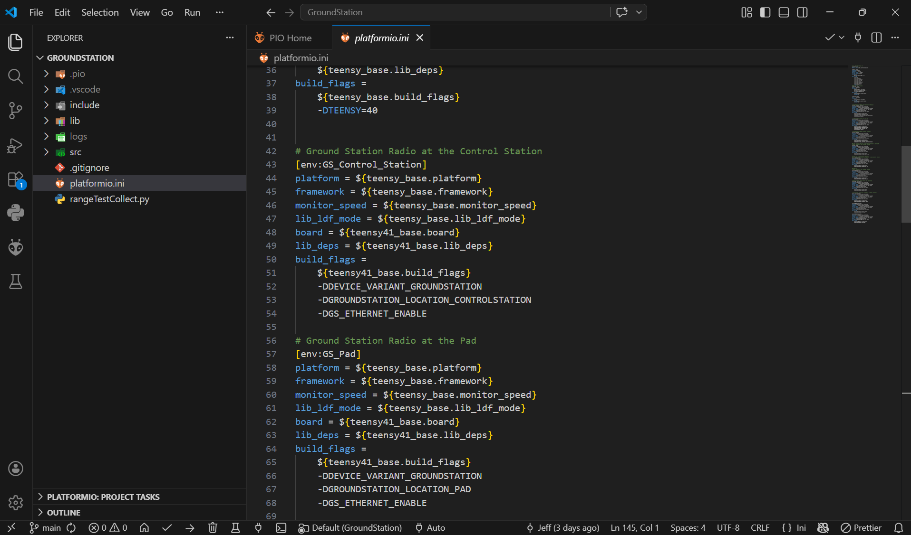

## 🧠 Software Setup

### 👤 Maintainer and Author

**Main Maintainer:** Jeffrey Lim

---

### 1. Prerequisites

Before starting, install:

* Visual Studio Code  
* PlatformIO (VSCode extension)

---

### 2. Project Structure

At the root of the repository:

* `lab/` → experimental / R&D code  
* `rangeTestData/` → scripts and data processing for range tests  
* `GroundStation/` → **main radios codebase (this is what you use)**  

---

### 3. Opening the Project (Critical Step)

Do **NOT** open the root repo.

You must open **only**:

`/GroundStation`

Reason: this folder contains the `platformio.ini` file, which defines all build environments.

---

### 4. PlatformIO Initialization

Once `GroundStation/` is opened:

* PlatformIO will automatically start configuring the environment  
* Wait until initialization completes (toolchains + dependencies installed)  

#### First-Time Setup Screen

---

### 5. PlatformIO Toolbar (Bottom Bar)

After initialization, you’ll see the PlatformIO toolbar in VSCode.

**From left to right:**

* ✔️ **Build** → Compiles the current environment  
* ➡️ **Upload** → Builds + flashes to the selected COM port  
* 🗑️ **Clean** → Clears cached build artifacts  
* 🧪 **Test** → (Unused)  
* 🔌 **Serial Monitor** → Opens serial output from device  
* ⚙️ **Environment Selector** → Choose which firmware variant to build  
* 🔌 **COM Port Selector** → Select target device (auto usually works)  

---

### 6. Selecting the Correct Environment

This is the **most important conceptual step**.

Each PlatformIO environment = a **different firmware behavior**.

---

#### 🔧 Core Modes

* `GS_Control_Station`  
  → Full ground station  
  → Ethernet + MQTT enabled  
  → Standard Control Station identity  

* `GS_Pad`  
  → Same as above, but identifies as **Pad**  

* `GS_No_Eth`  
  → Ground station without Ethernet (for Teensy 4.0)  

---

#### 🚀 Flight Computer Simulation

* `FC_mock`  
  → Simulates Flight Computer  
  → Sends telemetry  
  → Responds to commands with ACKs  
  → Used for testing without real FC  

---

#### 📡 Range Testing

* `RANGETEST_GS`  
  → Ground station for range testing  
  → CSV-style logs  
  → No Ethernet  

* `RANGETEST_FC`  
  → FC-side range test firmware  
  → Generates structured telemetry  

---

#### 🧪 Misc

* `TEST_*` → Hardware-specific testing  
* `DEBUG_*` → Temporary/debug runs  

---

### 7. Frequency Band Behavior (Important Clarification)

Don’t overthink this:

* The code **automatically detects frequency band from hardware**
  * 433 MHz → Band A  
  * 900 MHz → Band B  

You **do not configure this in software**.

---

### 8. Hardware Compatibility Constraint

* **Teensy 4.1**
  * Supports all environments  
  * Required for Ethernet  

* **Teensy 4.0**
  * No Ethernet support  
  * Only use:
    * `GS_No_Eth`
    * Range test modes
    * `FC_mock`

---

### 9. Build & Upload Flow

Minimal correct workflow:

1. Select environment  
2. Select COM port (if auto fails)  
3. Click ✔️ (Ensure that it builds)  
4. Click ➡️ Upload  
5. Open 🔌 Serial Monitor  

---

### ⚠️ Quick Debug Checklist

If something doesn’t work, check:

* Wrong folder opened (not `GroundStation/`)  
* Wrong environment selected  
* Wrong COM port  
* PlatformIO not finished installing dependencies  

---